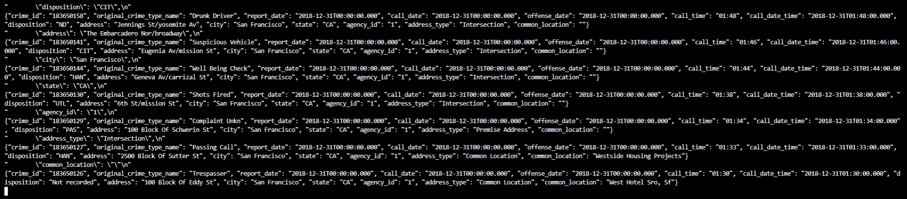
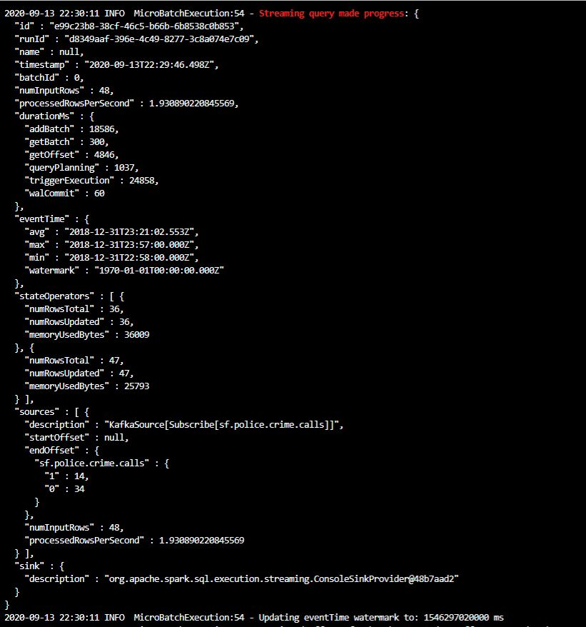
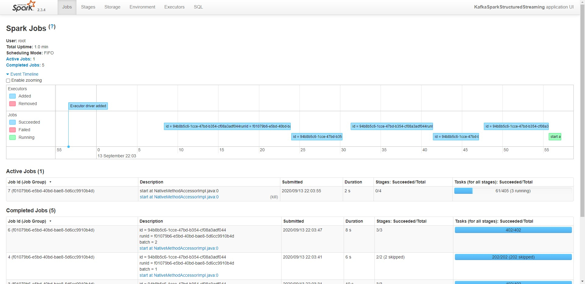

# SF Crime Statistics

## Project Overview
In this project, you will be provided with a real-world dataset, extracted from Kaggle, on San Francisco crime incidents, and you will provide statistical analyses of the data using Apache Spark Structured Streaming. You will draw on the skills and knowledge you've learned in this course to create a Kafka server to produce data, and ingest data through Spark Structured Streaming.

You can try to answer the following questions with the dataset:
* What are the top types of crimes in San Fransisco?
* What is the crime density by location?

## Development Environment
You may choose to create your project in the workspace we provide here, or if you wish to develop your project locally, you will need to set up your environment properly as described below:
* Spark 2.4.3
* Scala 2.11.x
* Java 1.8.x
* Kafka build with Scala 2.11.x
* Python 3.6.x or 3.7.x

## Steps 
### Step 1
The first step is to build a simple Kafka server.
Complete the code for the server in `producer_server.py` and `kafka_server.py`.

__Take a screenshot of your kafka-console-consumer output. You will need to include this screenshot as part of your project submission.__

#### Kafka Console Consumer Output

### Step 2 
* Apache Spark already has an integration with Kafka brokers, so we would not normally need a separate Kafka consumer. However, we are going to ask you to create one anyway. Why? We'd like you to create the consumer to demonstrate your understanding of creating a complete Kafka Module (producer and consumer) from scratch. In production, you might have to create a dummy producer or consumer to just test out your theory and this will be great practice for that.
* Implement all the TODO items in data_stream.py. You may need to explore the dataset beforehand using a Jupyter Notebook.
* Do a spark-submit using this command: `spark-submit --packages org.apache.spark:spark-sql-kafka-0-10_2.11:2.3.4 --master local[*] data_stream.py`.
* Take a screenshot of your progress reporter after executing a Spark job. __You will need to include this screenshot as part of your project submission.__
* Take a screenshot of the Spark Streaming UI as the streaming continues. __You will need to include this screenshot as part of your project submission.__

#### Progress reporter

#### Spark Streaming UI

### Step 3
Write the answers to these questions in the README.md doc of your GitHub repo:

1. How did changing values on the SparkSession property parameters affect the throughput and latency of the data?
2. What were the 2-3 most efficient SparkSession property key/value pairs? Through testing multiple variations on values, how can you tell these were the most optimal?

#### Answer 1

#### Answer 2